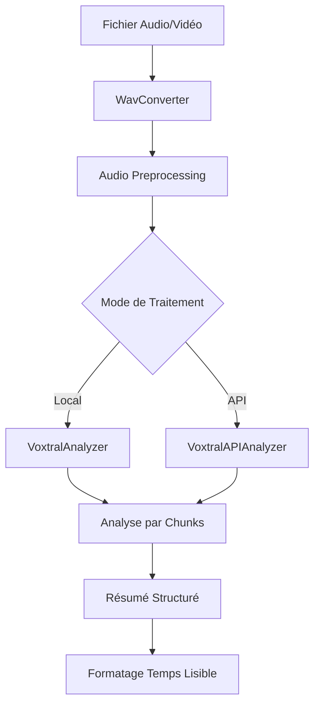

# Architecture du Projet MeetingNotes

Ce document décrit l'organisation du code et l'architecture du projet MeetingNotes.

## Structure des Dossiers

```
meetingnotes/
├── main.py                     # Point d'entrée principal
├── requirements.txt            # Dépendances Python
├── .env.example               # Modèle de configuration
├── .gitignore                 # Fichiers à ignorer par Git
├── README.md                  # Documentation utilisateur
├── ARCHITECTURE.md            # Ce fichier
└── src/                       # Code source principal
    └── meetingnotes/          # Package principal
        ├── __init__.py        # Configuration du package
        ├── audio/             # Traitement audio
        │   ├── __init__.py
        │   ├── wav_converter.py    # Conversion de formats audio/vidéo
        │   └── normalizer.py       # Normalisation du volume
        ├── ai/                # Intelligence artificielle Voxtral
        │   ├── __init__.py
        │   ├── voxtral_analyzer.py     # Analyseur Voxtral local
        │   ├── voxtral_api_analyzer.py # Analyseur Voxtral API
        │   ├── memory_manager.py       # Gestion optimisée de la mémoire
        │   └── prompts_config.py       # Configuration centralisée des prompts
        ├── core/              # Logique métier
        │   ├── __init__.py
        │   ├── voxtral_direct.py       # Traitement direct
        │   └── voxtral_api.py          # Interface API Mistral
        ├── ui/                # Interface utilisateur
        │   ├── __init__.py
        │   ├── main.py                 # Interface Gradio principale
        │   └── handlers.py             # Gestionnaires d'événements
        └── utils/             # Utilitaires
            ├── __init__.py
            └── time_formatter.py       # Formatage des durées
```

## Modules et Responsabilités

### 🎵 Module Audio (`src/meetingnotes/audio/`)

**Responsabilité** : Traitement et préparation des fichiers audio/vidéo

- **`WavConverter`** : Conversion de différents formats (MP3, WAV, vidéos) vers WAV mono 16kHz
- **`Normalizer`** : Normalisation du volume audio pour optimiser le traitement vocal

### 🤖 Module IA (`src/meetingnotes/ai/`)

**Responsabilité** : Intelligence artificielle basée sur Voxtral

- **`VoxtralAnalyzer`** : Analyseur Voxtral pour traitement local (Mini-3B/Small-24B)
- **`VoxtralAPIAnalyzer`** : Analyseur Voxtral pour API Mistral Cloud
- **`MemoryManager`** : Gestion optimisée de la mémoire GPU/MPS avec nettoyage automatique
- **`VoxtralPrompts`** : Configuration centralisée de tous les prompts système

### ⚙️ Module Core (`src/meetingnotes/core/`)

**Responsabilité** : Logique métier et orchestration

- **`voxtral_direct.py`** :
  - `process_file_direct_voxtral()` : Préparation des fichiers audio
  - `on_audio_instruct_summary()` : Analyse directe locale par chunks
- **`voxtral_api.py`** :
  - `on_audio_direct_analysis_api()` : Analyse directe via API Mistral
  - Interface unifiée pour les appels API Voxtral

### 🖥️ Module UI (`src/meetingnotes/ui/`)

**Responsabilité** : Interface utilisateur

- **`main.py`** : Interface Gradio principale avec modes local/API simplifiée
- **`handlers.py`** : Gestionnaires d'événements pour l'analyse directe

## Flux de Données



### Étapes de Traitement

#### Mode Analyse Directe
1. **Conversion** : `WavConverter` → Format WAV standardisé
2. **Préparation** : Découpage optionnel début/fin
3. **Chunking** : Division intelligente en segments (5-25 min)
4. **Analyse Voxtral** : Transcription + résumé structuré par chunk
5. **Agrégation** : Assemblage du résumé final
6. **Affichage** : Temps de traitement en format lisible français

## Patterns Architecturaux

### Séparation des Responsabilités

- **Audio** : Conversion et traitement des fichiers audio/vidéo
- **IA** : Analyseurs Voxtral et gestion mémoire optimisée
- **Core** : Orchestration entre mode local/API et gestion des chunks
- **UI** : Interface utilisateur moderne avec feedback temps réel

### Injection de Dépendances

- Tokens HuggingFace et Mistral API injectés via variables d'environnement
- Modèles Voxtral configurables (Mini/Small, Local/API) via l'interface
- Prompts centralisés dans `VoxtralPrompts` pour faciliter la maintenance

### Architecture en Couches

```
┌─────────────────┐
│   Interface UI  │  ← Gradio, gestion des événements
├─────────────────┤
│  Logique Métier │  ← Orchestration Local/API, chunking
├─────────────────┤
│   Voxtral AI    │  ← Analyseurs Local/API, prompts centralisés
├─────────────────┤
│ Traitement Audio│  ← Conversion, normalisation, extraits
└─────────────────┘
```

## Extensibilité

### Ajout de Nouveaux Formats Audio
- Étendre `WavConverter.convert_to_wav()` pour supporter d'autres codecs

### Nouveaux Modèles IA
- Implémenter l'interface analyseur dans `src/meetingnotes/ai/`
- Ajouter les prompts spécifiques dans `VoxtralPrompts`
- Mettre à jour les handlers pour l'intégration UI

### Nouveaux Types de Prompts
- Ajouter des méthodes dans `VoxtralPrompts`
- Supporter de nouveaux types de réunions ou langues

### Nouvelles Interfaces
- Créer des modules dans `src/meetingnotes/ui/`
- API REST, CLI, intégration webhooks, etc.

## Sécurité

- **Variables d'environnement** : Tokens sensibles via `.env`
- **Gitignore** : Exclusion des fichiers temporaires et sensibles
- **Modularité** : Isolation des composants critiques

## Tests

Structure recommandée pour les tests :

```
tests/
├── unit/
│   ├── test_audio/
│   ├── test_ai/
│   ├── test_core/
│   └── test_ui/
└── integration/
    └── test_full_pipeline.py
```