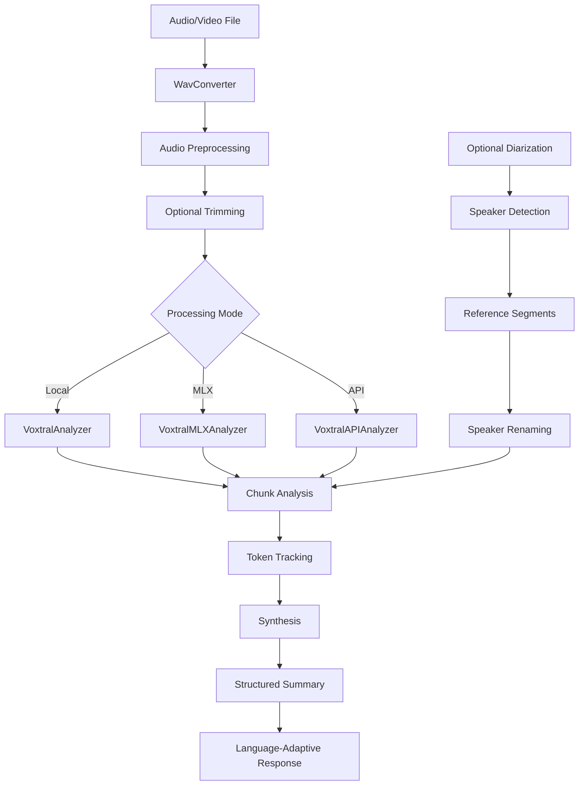

# MeetingNotes Architecture

This document describes the code organization and architecture of the MeetingNotes project.

## 📁 Project Structure

```
meetingnotes/
├── main.py                     # Main entry point
├── requirements.txt            # Python dependencies
├── .env.example               # Configuration template
├── .gitignore                 # Git ignore rules
├── LICENSE                    # MIT License
├── README.md                  # User documentation
├── ARCHITECTURE.md            # This file
├── assets/                    # Screenshots and documentation images
│   ├── api mode.png
│   ├── diarization.png
│   ├── local mode.png
│   ├── meeting analysis parameters.png
│   ├── meeting summary.png
│   ├── mlx mode.png
│   └── trim_options.png
└── src/                       # Main source code
    └── meetingnotes/          # Main package
        ├── __init__.py        # Package configuration
        ├── audio/             # Audio processing
        │   ├── __init__.py
        │   ├── wav_converter.py    # Audio/video format conversion
        │   └── normalizer.py       # Volume normalization
        ├── ai/                # Artificial Intelligence
        │   ├── __init__.py         # AI module exports
        │   ├── voxtral_analyzer.py     # Local Voxtral analyzer (Transformers)
        │   ├── voxtral_api_analyzer.py # API Voxtral analyzer (Mistral Cloud)
        │   ├── voxtral_mlx_analyzer.py # MLX Voxtral analyzer (Apple Silicon)
        │   ├── diarization.py          # Speaker diarization (pyannote)
        │   ├── memory_manager.py       # Optimized memory management
        │   └── prompts_config.py       # Centralized prompt configuration
        ├── core/              # Business logic
        │   ├── __init__.py
        │   ├── voxtral_direct.py       # Direct processing (Transformers)
        │   ├── voxtral_api.py          # Mistral API interface
        │   ├── voxtral_mlx.py          # MLX Apple Silicon interface
        │   └── voxtral_gguf.py         # GGUF models interface (legacy)
        ├── ui/                # User interface
        │   ├── __init__.py
        │   ├── main.py                 # Main Gradio interface
        │   ├── handlers.py             # Event handlers
        │   └── labels.py               # UI labels and text constants
        └── utils/             # Utilities
            ├── __init__.py             # Utils module
            ├── time_formatter.py       # Duration formatting
            └── token_tracker.py        # Token usage tracking
```

## 🏗️ Modules and Responsibilities

### 🎵 Audio Module (`src/meetingnotes/audio/`)

**Responsibility**: Audio/video file processing and preparation

- **`WavConverter`**: Converts various formats (MP3, WAV, videos) to standardized WAV mono 16kHz
- **`Normalizer`**: Audio volume normalization for optimal voice processing

### 🤖 AI Module (`src/meetingnotes/ai/`)

**Responsibility**: Artificial intelligence based on Voxtral models

#### Core Analyzers
- **`VoxtralAnalyzer`**: Local Voxtral analyzer using Transformers (PyTorch)
  - Supports Mini-3B and Small-24B models
  - Quantization support: Default, 8bit, 4bit
  - GPU acceleration: CUDA, MPS, optimized CPU

- **`VoxtralAPIAnalyzer`**: Cloud-based analysis via Mistral API
  - Uses `voxtral-mini-latest` and `voxtral-small-latest`
  - No local resources required
  - Always up-to-date models

- **`VoxtralMLXAnalyzer`**: Apple Silicon optimized analyzer
  - Native MLX framework support
  - M1/M2/M3 processor optimization
  - Memory-efficient quantized models

#### Support Components
- **`Diarization`**: Speaker identification using pyannote.audio
  - Automatic speaker detection
  - Reference segment extraction
  - Speaker renaming capabilities

- **`MemoryManager`**: Optimized GPU/MPS memory management
  - Automatic cleanup between chunks
  - Multi-platform support

- **`VoxtralPrompts`**: Centralized prompt configuration
  - Language-adaptive instructions
  - Modular summary sections
  - Consistent prompt templates

### ⚙️ Core Module (`src/meetingnotes/core/`)

**Responsibility**: Business logic and orchestration

- **`voxtral_direct.py`**: Local processing orchestration
  - `process_file_direct_voxtral()`: Audio file preparation
  - Chunk management and synthesis

- **`voxtral_api.py`**: API processing orchestration
  - Mistral Cloud API interface
  - Request handling and error management

- **`voxtral_mlx.py`**: MLX processing orchestration
  - Apple Silicon optimization
  - MLX-specific model loading

### 🖥️ UI Module (`src/meetingnotes/ui/`)

**Responsibility**: User interface and interaction

- **`main.py`**: Main Gradio interface
  - 3 processing modes: Local, MLX, API
  - Model and precision selection
  - Diarization workflow integration
  - Modular summary sections

- **`handlers.py`**: Event handlers
  - File processing workflows
  - Mode switching logic
  - Diarization management

- **`labels.py`**: Centralized UI text management
  - English interface labels
  - Maintainable text constants
  - Internationalization support

### 🛠️ Utils Module (`src/meetingnotes/utils/`)

**Responsibility**: Utility functions and helpers

- **`time_formatter.py`**: Duration formatting utilities
- **`token_tracker.py`**: Token usage tracking
  - Input/output token counting
  - Statistics across processing modes
  - Comprehensive usage summaries

## 🔄 Data Flow



### Processing Pipeline

#### 1. File Preparation
1. **Format Conversion**: `WavConverter` → Standardized WAV format
2. **Optional Trimming**: Remove seconds from start/end
3. **Quality Validation**: Audio duration and format verification

#### 2. Optional Diarization
1. **Speaker Detection**: pyannote.audio automatic identification
2. **Reference Extraction**: Audio samples for each speaker
3. **Custom Renaming**: Human-readable speaker names
4. **Context Integration**: Speaker information in analysis prompts

#### 3. Processing Mode Selection
- **Local Mode**: Transformers with PyTorch
- **MLX Mode**: Apple Silicon optimization
- **API Mode**: Mistral Cloud processing

#### 4. Intelligent Analysis
1. **Language Detection**: Automatic meeting language identification
2. **Chunk Processing**: Smart division for long files (5-25 minutes)
3. **Token Tracking**: Comprehensive usage statistics
4. **Context Enrichment**: Speaker and temporal information

#### 5. Summary Generation
1. **Modular Sections**: 9 customizable summary sections
2. **Preset Profiles**: Action, Information, or Complete
3. **Language-Adaptive**: Responds in detected meeting language
4. **Final Synthesis**: Coherent multi-chunk aggregation

## 🎯 Key Features

### Language Intelligence
- **Automatic Detection**: Identifies meeting language from audio
- **Adaptive Response**: Responds in detected language (French/English/Other)
- **Consistent Instructions**: Centralized multilingual prompt configuration

### Processing Modes
- **Local**: Privacy-focused, on-device processing
- **MLX**: Apple Silicon optimized for best performance
- **API**: Cloud-based with latest models

### Memory Optimization
- **Quantized Models**: 4bit/8bit support for memory efficiency
- **Smart Management**: Automatic cleanup between processing chunks
- **Multi-Platform**: CUDA, MPS, and optimized CPU support

### User Experience
- **Centralized Labels**: Maintainable English interface
- **Visual Organization**: Intuitive layout with grouped sections
- **Real-Time Feedback**: Progress indicators and token usage
- **Interactive Diarization**: Speaker listening and renaming

## 🔧 Architectural Patterns

### Separation of Concerns
- **Audio**: File conversion and preprocessing
- **AI**: Model inference and intelligent analysis
- **Core**: Business logic orchestration
- **UI**: User interaction and interface management
- **Utils**: Shared utilities and helpers

### Dependency Injection
- **Environment Variables**: HuggingFace and Mistral API tokens
- **Configurable Models**: Runtime model selection
- **Centralized Configuration**: Prompts and settings management

### Layered Architecture

```
┌─────────────────────┐
│    User Interface   │  ← Gradio, event handling, labels
├─────────────────────┤
│   Business Logic    │  ← Mode orchestration, chunk management
├─────────────────────┤
│  AI Processing      │  ← Voxtral analyzers, diarization
├─────────────────────┤
│  Audio Processing   │  ← Conversion, normalization
├─────────────────────┤
│    Utilities        │  ← Time formatting, token tracking
└─────────────────────┘
```

## 🚀 Extensibility

### Adding New Processing Modes
1. Create analyzer in `src/meetingnotes/ai/`
2. Add orchestration logic in `src/meetingnotes/core/`
3. Update UI handlers and mode selection
4. Integrate token tracking

### New Audio Formats
- Extend `WavConverter.convert_to_wav()` for additional codecs
- Update format validation in handlers

### Additional Languages
- Extend language detection in `VoxtralPrompts`
- Add language-specific prompt variations
- Update UI labels for new languages

### New Summary Sections
- Add section definitions in `VoxtralPrompts.AVAILABLE_SECTIONS`
- Update UI checkboxes and preset profiles
- Implement section-specific prompt logic

### Alternative Interfaces
- Create modules in `src/meetingnotes/ui/`
- REST API, CLI, webhook integrations
- Maintain consistent core logic usage

## 🔒 Security & Privacy

### Data Protection
- **Local Processing**: Option for entirely on-device analysis
- **No Data Storage**: Files processed and cleaned automatically
- **Environment Isolation**: Sensitive tokens via `.env` files

### Access Control
- **Token Management**: Secure API key handling
- **File Permissions**: Temporary file cleanup
- **Git Security**: Sensitive files excluded via `.gitignore`

## 🧪 Testing Strategy

Recommended test structure:

```
tests/
├── unit/
│   ├── test_audio/
│   │   ├── test_wav_converter.py
│   │   └── test_normalizer.py
│   ├── test_ai/
│   │   ├── test_voxtral_analyzer.py
│   │   ├── test_voxtral_api_analyzer.py
│   │   ├── test_voxtral_mlx_analyzer.py
│   │   ├── test_diarization.py
│   │   └── test_prompts_config.py
│   ├── test_core/
│   │   ├── test_voxtral_direct.py
│   │   ├── test_voxtral_api.py
│   │   └── test_voxtral_mlx.py
│   ├── test_ui/
│   │   ├── test_handlers.py
│   │   └── test_labels.py
│   └── test_utils/
│       ├── test_time_formatter.py
│       └── test_token_tracker.py
├── integration/
│   ├── test_full_pipeline.py
│   ├── test_mode_switching.py
│   └── test_diarization_workflow.py
└── fixtures/
    ├── audio_samples/
    └── expected_outputs/
```

## 📊 Performance Considerations

### Memory Management
- **Quantized Models**: Reduced memory footprint
- **Chunk Processing**: Large files handled efficiently
- **Automatic Cleanup**: Memory released between operations

### Processing Optimization
- **Model Caching**: Avoid repeated loading
- **Parallel Processing**: Multi-threading where applicable
- **Smart Chunking**: Optimal segment sizes for accuracy

### User Experience
- **Progress Feedback**: Real-time processing updates
- **Error Handling**: Graceful degradation and recovery
- **Resource Monitoring**: Token usage and memory tracking

---

This architecture supports the project's goals of providing intelligent, multilingual meeting analysis with flexible processing options and an intuitive user experience.